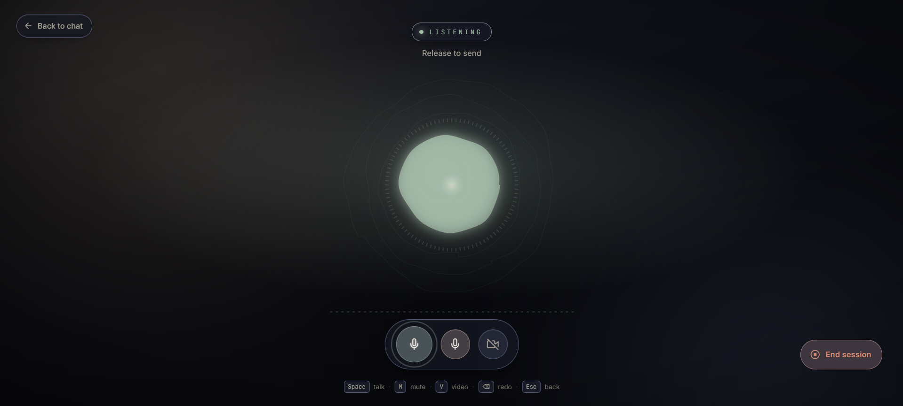
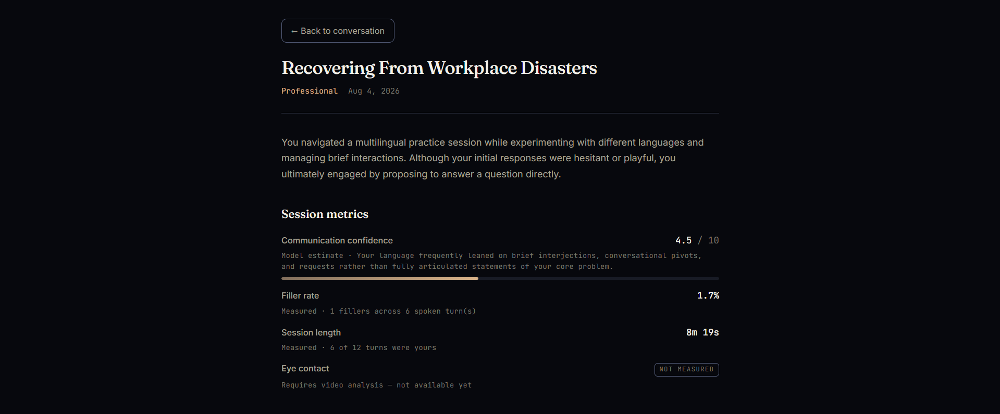
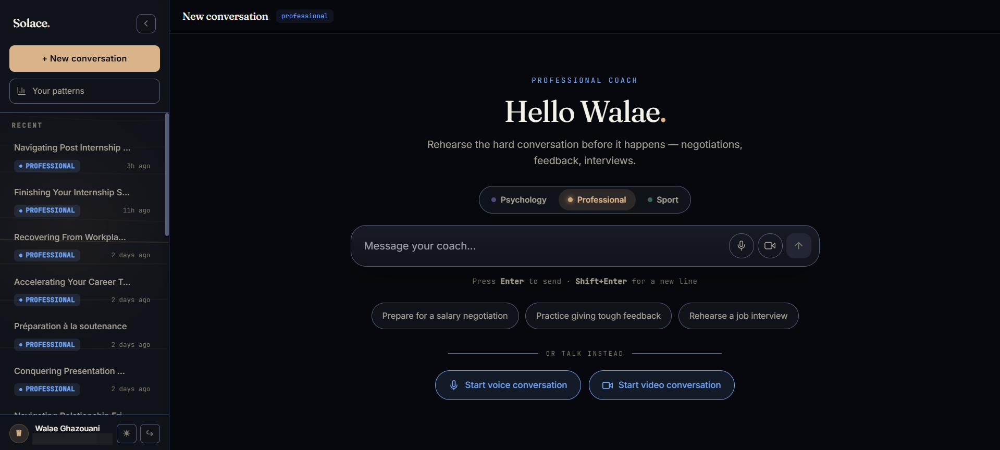
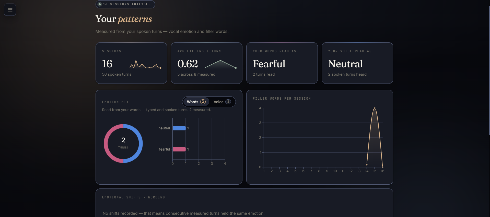
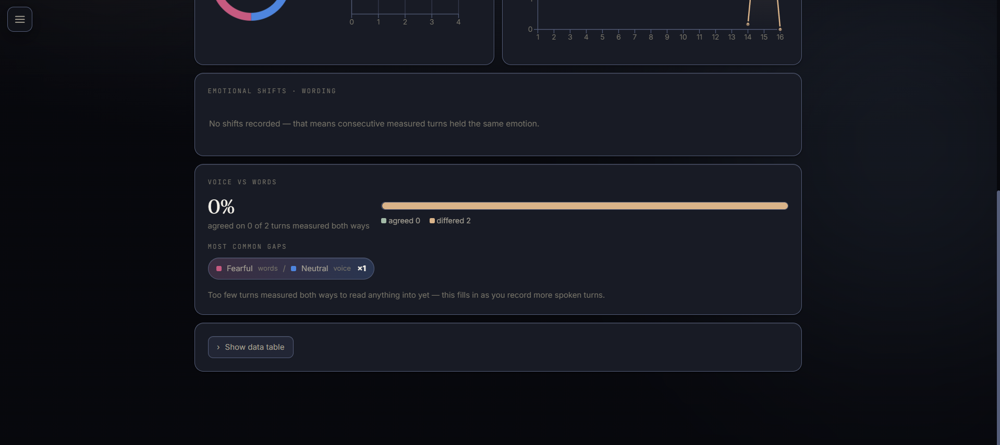
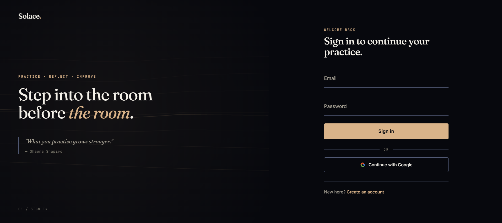
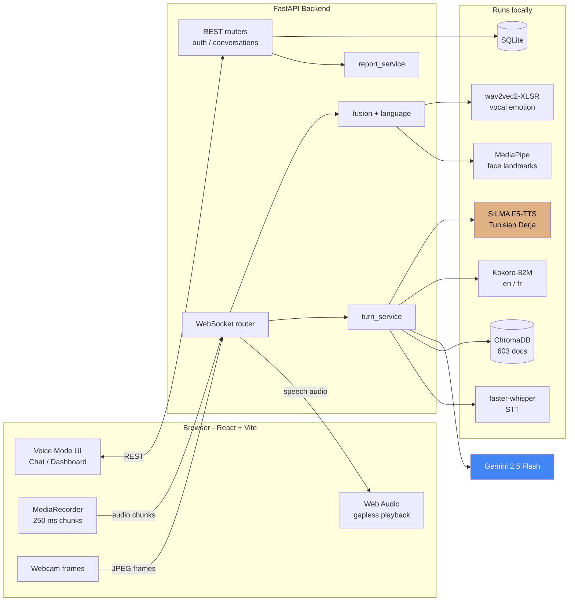
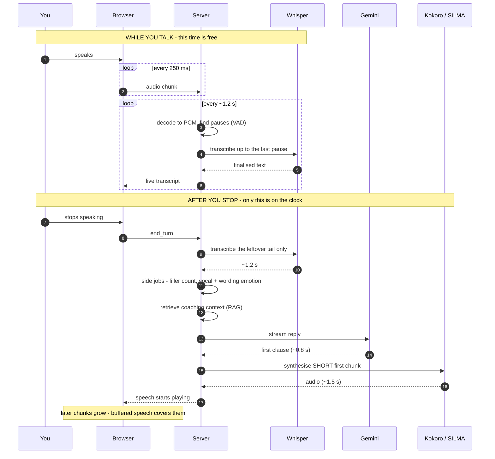
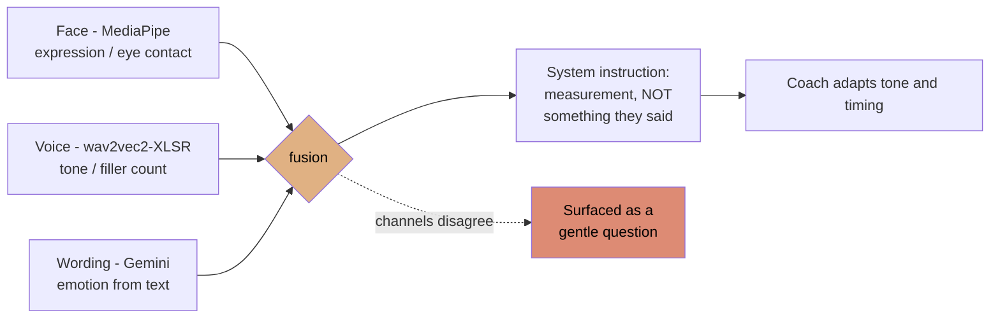
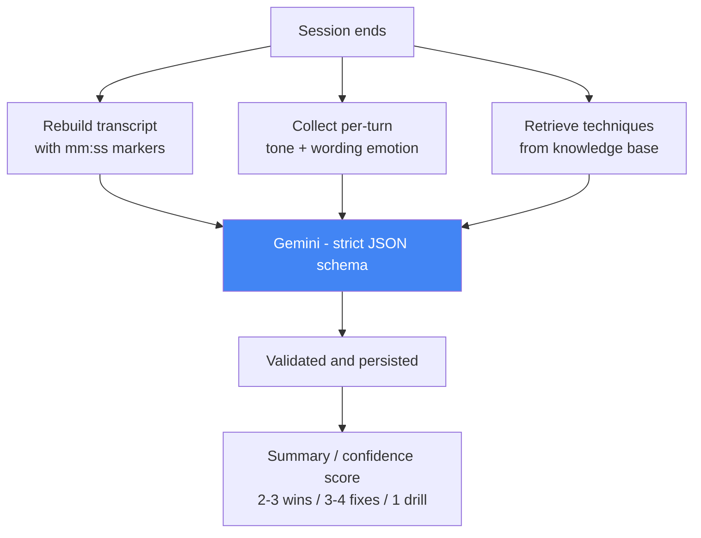

<div align="center">

# Solace

**A real-time, multimodal AI communication coach — that listens, watches, and answers back in your language.**

Practice the conversations that actually make you nervous. Solace hears *how* you say it, not just what you say, and speaks back in English, French, or Tunisian Derja.

[](https://www.python.org/)
[](https://fastapi.tiangolo.com/)
[](https://react.dev/)
[](https://github.com/SYSTRAN/faster-whisper)
[](https://ai.google.dev/)
[](https://www.trychroma.com/)

</div>

---

## Table of contents

- [The problem](#the-problem)
- [What Solace does](#what-solace-does)
- [Screenshots](#screenshots)
- [Architecture](#architecture)
- [Pipelines](#pipelines)
- [Performance](#performance)
- [Tech stack](#tech-stack)
- [Getting started](#getting-started)
- [How to use it](#how-to-use-it)
- [Configuration](#configuration)
- [Project structure](#project-structure)
- [Known limitations](#known-limitations)
- [Roadmap](#roadmap--how-this-could-be-improved)

---

## The problem

> Sarra has a final-round interview on Thursday. She has rehearsed her answers a dozen times in her head, and they sound fine in there. What she cannot rehearse is the part that actually costs her the offer: the way her voice tightens when she is asked about salary, the four *"euh…"*s she packs into one sentence, the way she looks at the table instead of the camera when she talks about leaving her last job.
>
> A human coach would catch all of that in ten minutes. A human coach also costs 80 DT an hour and books out two weeks ahead.
>
> So Sarra opens Solace, picks **Professional**, and starts talking — in the mix of Derja and French she actually speaks. The coach answers out loud, in the same language, about a second after she stops. It notices she goes quiet on the salary question and asks her why. Afterwards it hands her a debrief: three things that landed, three to fix, each one timestamped to the moment it happened, each fix tied to a named technique from a real coaching manual.

**Most "AI interview prep" tools are a chatbot with a text box.** They read your words and miss the entire signal — the hesitation, the flat delivery, the broken eye contact. And essentially none of them work in Tunisian Derja, which is what a Tunisian graduate actually panics in.

Solace is built for the gap between those two facts.

---

## What Solace does

| | |
|---|---|
| 🎙️ **Speaks and listens in real time** | Full-duplex voice over WebSocket. Interrupt it mid-sentence and it stops, like a person would. |
| 🇹🇳 **Handles Tunisian Derja** | Speech synthesis runs on a **custom F5-TTS fine-tune** (`Eya-Jmaa/silma-tts-derja`), with Derja-aware prompting that mirrors natural Derja/French code-switching. |
| 👁️ **Watches how you present** | MediaPipe face landmarks track expression, eye contact, and self-touch gestures from the webcam. |
| 🔊 **Hears how you sound** | A wav2vec2-XLSR emotion classifier reads vocal tone; a second verbatim pass counts filler words. |
| 🧠 **Separates its evidence** | Face, voice, and wording are three independent channels. When they disagree, that gap is surfaced — not averaged away. |
| 📚 **Grounded, not improvised** | Advice is retrieved from a 603-document knowledge base of real clinical and coaching material (CBT manuals, motivational interviewing guides, sport-psychology papers). |
| 🌍 **Follows your language, per turn** | Start in English, switch to French mid-session — the very next reply comes back in French, voice included. |
| 📊 **Writes you a real debrief** | A timestamped, technique-cited report with a confidence score and a practice drill. |

Three coaching modes — **Psychology**, **Professional**, and **Sport** — swap the persona and steer which part of the knowledge base is searched.

---

## Screenshots

### Voice Mode



*Push-to-talk with live state (`LISTENING` → `THINKING` → `SPEAKING`). The orb is driven by a live FFT of the audio stream, so it reacts to your actual voice. Keyboard-first: `Space` to talk, `M` mute, `V` video, `Esc` back.*

### The session report



*Generated from a real 8-minute session. Note the **provenance labels**: `Measured` for filler rate (1 filler across 6 spoken turns) versus `Model estimate` for the confidence score — and eye contact marked **`NOT MEASURED`** because the camera was off. The system reports what it could not observe rather than inventing a number.*

### Home — mode selection and history



*Three coaching modes, quick-start prompts, and entry into voice or video. The sidebar shows real sessions in both English and French — the per-turn language routing in daily use.*

### Your patterns — cross-session analytics

| Trends over time | Voice vs. words |
|---|---|
|  |  |

*Left: filler-word rate, emotion mix, and per-session trends across 16 analysed sessions. Right: the **channel-disagreement** view — where your wording read `Fearful` but your voice read `Neutral`. This is the multimodal fusion made visible, and it deliberately says "too few turns to read anything into yet" rather than over-claiming on thin data.*

### Sign in



*Email + password with 6-digit verification, or Google OAuth.*

---

## Architecture

The browser holds **one WebSocket** open for the whole session — audio and video frames go up, text and speech come back down. Everything else (auth, history, reports) is ordinary HTTP.



**Design note:** Gemini is the *only* cloud dependency. Speech recognition, both speech synthesis engines, the vector store, and both signal analysers all run on the host machine. That is a deliberate privacy choice — practice sessions about your job, your anxiety, or your relationships never leave your machine except as text to the LLM.

---

## Pipelines

### 1. The voice turn — the loop that matters

The core insight: **most of the work happens while you are still speaking**, so when you stop, there is very little left to do.



**Two optimisations do the heavy lifting:**

1. **Incremental transcription.** Audio is decoded to raw PCM and cut **only inside silences** detected by VAD — never mid-word. Each region of speech is transcribed exactly once, while you are still talking. Post-speech transcription dropped from **5.10 s → 1.24 s**.

2. **Smallest-chunk-first synthesis.** Kokoro does not stream — its first byte arrives with its last — and costs roughly `0.8 s + 0.03 s × characters`. So time-to-first-audio is set almost entirely by how much text the *first* request carries. The opening chunk is cut at the first clause boundary; later chunks grow. First chunk went from **132 → 52 characters**.

### 2. Multimodal signal fusion



The prompt is explicit that these are **classifier readings, not facts** — the coach must write *"your wording read as frustrated"*, never *"you sounded frustrated"*, and may never claim to have heard something a channel did not report. Typed conversations carry only the wording channel, and the model is told so.

### 3. The session report



Every observation must cite a real `[mm:ss]` moment, and every improvement must name a technique from the retrieved list *by its exact name* — or return `null`. The prompt forbids inventing events, numbers, or quotes.

---

## Performance

Measured end to end on a real 39-second spoken turn (CPU-only, `whisper-base`, Kokoro CPU container):

| Stage | Before | After | Gain |
|---|---:|---:|---|
| Speech-to-text after you stop | 5.10 s | **1.24 s** | **4.1× faster** |
| Knowledge retrieval (warm) | 0.05 s | 0.05 s | — |
| Gemini to first token | 0.79 s | 0.79 s | — |
| First speech audio | 5.49 s | **~2.4 s** | **2.3× faster** |
| **Total silence before the coach replies** | **~11.4 s** | **~4.5 s** | **2.5× faster** |

**The trade-off, stated honestly:** incremental transcription costs ~0.4× real-time of background CPU while you speak, and chunked decoding produces text that differs somewhat from a single pass over the whole recording. Speed was bought with CPU and a little transcription stability — not for free.

### Vocal emotion model

Trained on **RAVDESS** with **speaker-independent `GroupKFold`** — train and test actor sets are asserted disjoint at runtime:

```python
assert len(train_actors & test_actors) == 0, "Speaker leakage!"
```

> This matters more than it looks. A random split leaks the same speakers into both sets, so the model learns to recognise *voices* rather than *emotions* — scoring ~90%+ that collapses completely on unseen speakers. Speaker-independent evaluation gives lower headline numbers that actually hold up.

*Add your measured accuracy / F1 here from `backend/training/evaluate_models.ipynb`.*

---

## Tech stack

| Layer | Technology | Why |
|---|---|---|
| **Frontend** | React + Vite, Zustand, Web Audio API | Zustand over Redux for far less ceremony; Web Audio for sample-accurate gapless playback |
| **Backend** | FastAPI, WebSockets, SQLAlchemy | Native async + first-class WebSocket support |
| **STT** | faster-whisper + Silero VAD | Much faster than reference Whisper; VAD enables silence-safe incremental cuts |
| **LLM** | Google Gemini 2.5 Flash | Sub-second time-to-first-token; streaming; strict JSON mode for reports |
| **TTS (en/fr)** | Kokoro-82M via Kokoro-FastAPI | 82M params, runs on CPU, natural prosody |
| **TTS (Derja)** | **Custom F5-TTS fine-tune** | Off-the-shelf Arabic TTS produces MSA, not Derja — this was fine-tuned to fix that |
| **STT (Derja)** | Vosk `linto-asr-ar-tn` | Purpose-built Tunisian Arabic acoustic model |
| **RAG** | ChromaDB + `multilingual-e5-base` | Multilingual embeddings matter when queries arrive in three languages |
| **Vision** | MediaPipe Face/Hand Landmarker | Runs at interactive rates on CPU |
| **Vocal emotion** | wav2vec2-XLSR-53 | Self-supervised pretraining survives small emotion datasets |
| **Database** | SQLite + SQLAlchemy | Zero-config for a single-node deployment |
| **Auth** | JWT + refresh cookie, bcrypt, Google OAuth | httpOnly refresh cookie; email verification via SMTP |

---

## Getting started

### Prerequisites

- **Python 3.12+**
- **Node.js 20+**
- **Docker** (for the Kokoro TTS container)
- A **Google Gemini API key** — [get one free](https://aistudio.google.com/apikey)
- A **Gmail App Password** for verification emails — [create one](https://myaccount.google.com/apppasswords) (requires 2-Step Verification)

### 1. Clone and configure

```bash
git clone https://github.com/<your-username>/solace.git && cd solace
```

```bash
cp backend/.env.example backend/.env
```

Open `backend/.env` and fill in `GEMINI_API_KEY`, `GMAIL_USER`, `GMAIL_APP_PASSWORD`, and the Google OAuth keys. Every field is documented inline.

### 2. Backend

```bash
cd backend && python -m venv venv && venv/Scripts/activate && pip install -r requirements.txt
```

> On macOS/Linux use `source venv/bin/activate`.

### 3. Speech synthesis

```bash
docker run -d -p 8880:8880 --name solace-kokoro ghcr.io/remsky/kokoro-fastapi-cpu:latest
```

> Set `KOKORO_AUTOSTART=true` in `.env` to have the backend manage this container itself.

Optional — the Tunisian Derja voice:

```bash
python backend/scripts/setup_silma_tts.py
```

### 4. Frontend

```bash
cd frontend && npm install && npm run dev
```

### 5. Run

```bash
cd backend && venv/Scripts/python.exe -m uvicorn main:app --reload --port 8000
```

Open **http://localhost:5173**. API docs live at **http://localhost:8000/docs**.

> **First launch is slow.** Whisper, the embedding model, MediaPipe bundles, and the emotion checkpoint all load at startup — expect 30–60 s before the first turn. They are warmed in a background thread so the UI stays responsive.

---

## How to use it

### Your first session

1. **Sign up** with an email address. A 6-digit code arrives in your inbox (valid 10 minutes). Google sign-in also works.
2. **Pick a mode** — Psychology, Professional, or Sport. This sets the coach's persona *and* which knowledge base sections get searched.
3. **Choose voice or text.** Voice Mode is the full experience.

### In Voice Mode

| Control | What it does |
|---|---|
| 🎤 **Hold to talk** | Records and streams while you speak — your transcript appears live |
| 📷 **Camera toggle** | Enables face analysis: expression, eye contact, self-touch |
| ✋ **Interrupt** | Start talking while the coach speaks and it stops immediately |
| 🌍 **Just switch language** | Say a sentence in French — the next reply comes back in French, voice included |

### Getting a useful report

- **Talk for at least 3–4 turns.** The report needs material; two turns produce thin results.
- **Keep the camera on** for the full picture — without it there is no expression or eye-contact data, and the report will say so rather than guess.
- **Click "End session"** — the report takes 10–20 s to generate.
- **Read the timestamps.** Every observation cites `[mm:ss]`, so you can replay the exact moment.

### Tips

- Practice a **real** upcoming conversation, not a hypothetical — the signal analysis is only interesting when you are genuinely a bit nervous.
- Use headphones to stop the coach's voice bleeding into your microphone.
- Speak Derja naturally, mixing in French — the prompt explicitly expects code-switching.

---

## Configuration

All settings live in `backend/.env` (see `.env.example`). The ones worth knowing:

| Variable | Default | What it controls |
|---|---|---|
| `GEMINI_MODEL` | `gemini-2.5-flash` | Coaching LLM |
| `WHISPER_MODEL` | `base` | `small`/`medium` are far more accurate but slower |
| `LANG_SWITCH_SUSTAIN_TURNS` | `1` | `1` = switch language on the very next turn; raise for stickier behaviour |
| `LANG_SWITCH_CONFIDENCE` | `0.6` | Detection confidence required before switching |
| `SILMA_PROVIDER` | `local` | `local` runs the Derja fine-tune in-process |
| `VIDEO_ANALYSIS_ENABLED` | `true` | Master switch for webcam analysis |
| `EMAIL_FAIL_SILENTLY` | `false` | Keep `false` so failed sends surface as errors |

---

## Project structure

```
solace/
├── backend/
│   ├── routers/          # ws.py (voice loop) · auth · conversations · messages · analytics
│   ├── services/
│   │   ├── stt_router.py       # STT engine selection (Whisper / Derja)
│   │   ├── tts_router.py       # TTS engine selection (Kokoro / SILMA)
│   │   ├── llm_service.py      # Gemini prompts: coaching, report, emotion
│   │   ├── rag_engine.py       # ChromaDB retrieval
│   │   ├── fusion.py           # combines face + voice + wording signals
│   │   ├── language_service.py # per-turn language resolution
│   │   ├── face_analyzer.py    # MediaPipe expression / eye contact
│   │   ├── emotion_model.py    # wav2vec2-XLSR vocal emotion
│   │   └── report_service.py   # session debrief generation
│   ├── data/rag_collection/    # knowledge-base ingestion pipeline
│   ├── training/               # RAVDESS emotion model training + evaluation
│   └── tests/
└── frontend/src/
    ├── components/voice/       # VoiceMode · VoiceOrb
    ├── services/audioEngine.js # gapless Web Audio playback
    ├── hooks/                  # useVAD · useWebcam · useAudioRecorder
    └── pages/
```

---

## Known limitations

Stated plainly, because a reviewer will find them anyway:

- **Derja speech recognition currently routes to multilingual Whisper.** The Vosk Tunisian model ships and the routing layer supports it, but `DERJA_STT_BACKEND` is unset by default, so Derja is transcribed at roughly MSA quality. Derja *synthesis* uses the fine-tuned model and is unaffected.
- **The SILMA reference voice is an English sample.** F5-TTS is a voice-cloning architecture, so Derja prosody would improve measurably with a native Derja reference clip.
- **Incremental transcription trades some stability for latency.** Chunked decoding differs from a single pass, most noticeably on long unbroken speech.
- **SQLite and in-memory session state** mean a single backend instance. Horizontal scaling needs Postgres and Redis.
- **CPU-bound.** Whisper and Kokoro dominate the latency budget; a GPU roughly halves the numbers above.

---

## Roadmap — how this could be improved

**Latency**
- GPU inference for Whisper and Kokoro — the single biggest remaining win
- Replace Kokoro with a genuinely streaming TTS to remove the fixed per-chunk cost
- Start RAG retrieval from the *partial* transcript while the user is still speaking

**Quality**
- Wire the Vosk Derja STT backend and benchmark it against Whisper on real Derja audio
- Record a native Derja reference clip for the voice-cloning model
- Fine-tune the emotion classifier on Tunisian speech — RAVDESS is North American English
- Re-score the retriever with a cross-encoder before results reach the prompt

**Product**
- Progress tracking across sessions (filler-word trend, confidence over time)
- Scenario library: salary negotiation, difficult feedback, first-date nerves
- Export reports to PDF
- Mobile-responsive Voice Mode

**Engineering**
- Postgres + Redis for multi-instance deployment
- Broader test coverage — the WebSocket turn loop is currently under-tested
- CI pipeline running the test suite and a linter on every push
- Structured telemetry to track real-world latency instead of one benchmark machine

---

## Acknowledgements

Built with [faster-whisper](https://github.com/SYSTRAN/faster-whisper), [Kokoro-82M](https://huggingface.co/hexgrad/Kokoro-82M), [F5-TTS](https://github.com/SWivid/F5-TTS), [MediaPipe](https://developers.google.com/mediapipe), [ChromaDB](https://www.trychroma.com/), and [Google Gemini](https://ai.google.dev/).

Knowledge base assembled from openly licensed clinical and coaching material (SAMHSA TIP-35, VA CBT manuals, motivational-interviewing guides, sport-psychology literature).

---

<div align="center">

**Solace** — *comfort, and psychological ease.*

</div>
